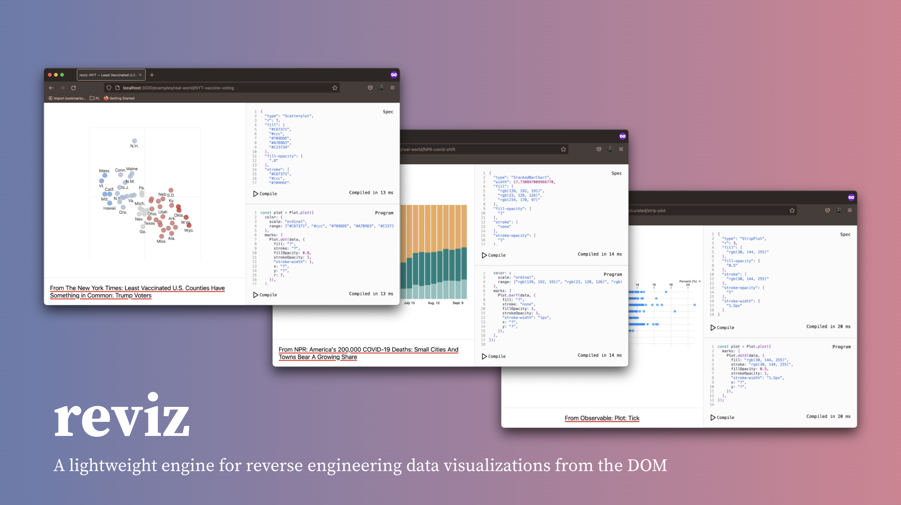
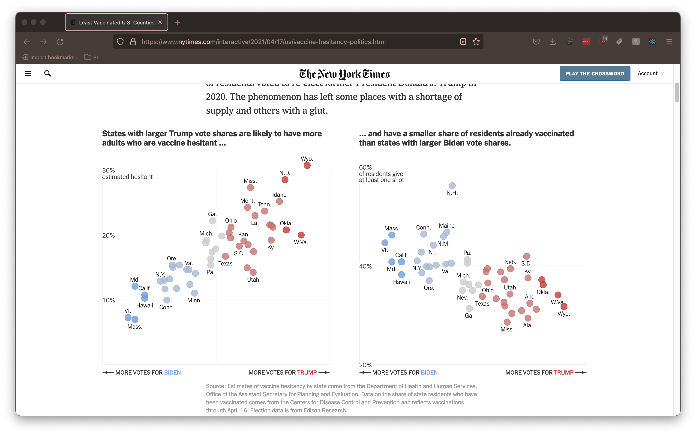

<div align="center">
  
  <br />
  <br />     
  <strong>
    A lightweight engine for reverse engineering data visualizations from the DOM
  </strong>
</div>

## `reviz`

`reviz` is a lightweight engine for reverse engineering data visualizations from the DOM. Its core goal is to assist in rapid visualization sketching and prototyping by automatically generating programs written using [`@observablehq/plot`](https://observablehq.com/@observablehq/plot) from input `svg` subtrees.

### How does `reviz` generate visualizations?

`reviz` works by generating small JavaScript programs using the `@observablehq/plot` library. These programs are intentionally _incomplete_ and contain "holes" represented by the `?` character. The presence of a hole indicates that the value for a particular attribute (e.g. the `r` of a bubble chart or the `fill` of a stacked bar chart) should be mapped to a column in a user's input dataset rather than kept static across all data elements. For example, for these visualizations from the New York Times:



`reviz` generates the following incomplete program:

```js
const plot = Plot.plot({
  color: {
    scale: 'ordinal',
    range: ['#C67371', '#ccc', '#709DDE', '#A7B9D3', '#C23734'],
  },
  marks: [
    Plot.dot(data, {
      fill: '?',
      stroke: '?',
      fillOpacity: 0.8,
      strokeOpacity: 1,
      'stroke-width': 1,
      x: '?',
      y: '?',
      r: 7,
    }),
  ],
});
```

Notice that `fill`, `stroke`, `x` and `y` are all inferred to be holes (`'?'`) that must be mapped to columns of an input dataset. Conversely, attributes like `fillOpacity` and `stroke-width` are automatically inferred because they are found to be consistent across all mark elements.

## Local development

To develop on `reviz` locally, ensure you have an installation of [`yarn`](https://classic.yarnpkg.com/lang/en/). We recommend using latest v1.

```sh
# If you have a local installation of Node and npm.
npm install --global yarn

# If you have Homebrew installed.
brew install yarn
```

### Building `reviz`

To build `reviz`, run `yarn build`. This will type check the codebase and emit JavaScript to the `dist` folder.

### Running the development server

To run `reviz` locally, run `yarn dev`. This will open a local development server at `localhost:3000`, which serves the [Next.js](https://nextjs.org/) build. We use Next.js purely as a local development server for testing examples.

### Linting and Formatting

We lint the codebase with ESLint and format it with Prettier. To manually lint the codebase, run `yarn lint`. To manually format the codebase, run `yarn format`.

We recommend installing plugins in your editor of choice to run ESLint and Prettier on save. If using VSCode, you can install:

- [`vscode-eslint`](https://marketplace.visualstudio.com/items?itemName=dbaeumer.vscode-eslint)
- [`prettier-vscode`](https://marketplace.visualstudio.com/items?itemName=esbenp.prettier-vscode)

To add support for for format on save, add the following to your workspace settings:

```json
"[typescript]": {
  "editor.formatOnSave": true,
  "editor.defaultFormatter": "esbenp.prettier-vscode"
}
```

### Typechecking

To run the TypeScript compiler manually in order to check for type errors, run `yarn check:ts`.
